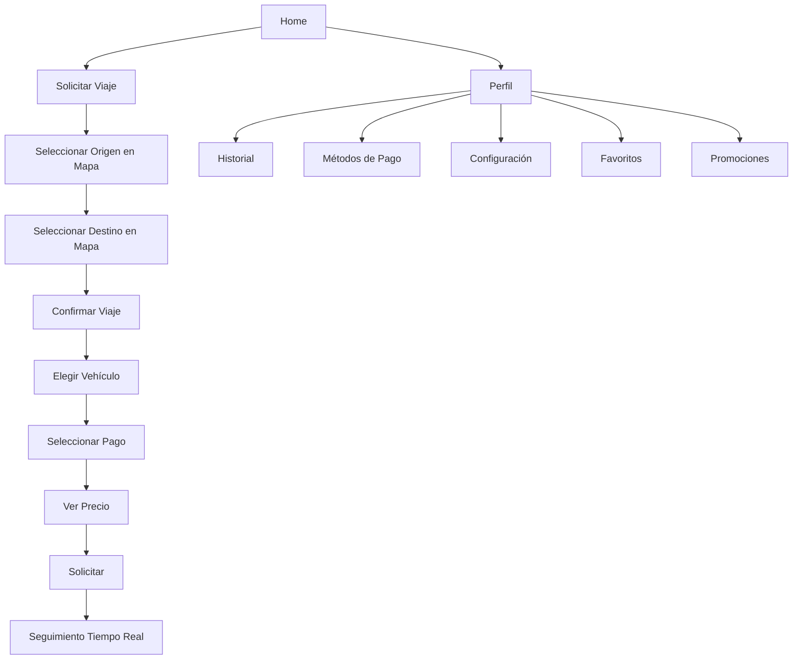

# 🎯 Resumen de Cambios - Nueva Lógica de Usuario

## ✅ Implementación Completada

Se ha transformado completamente la experiencia del usuario en PingGo, eliminando la **obligatoriedad de la dirección** y creando un flujo similar a **Uber/Didi**.

---

## 📱 Pantallas Creadas (6 nuevas)

### 1. 🗺️ RequestTripScreen
**Propósito**: Selección dinámica de origen y destino
- Mapa interactivo con Google Maps
- Tap para seleccionar puntos
- Detección automática de ubicación
- Marcadores visuales
- **Sin dirección obligatoria**

### 2. ✅ ConfirmTripScreen
**Propósito**: Confirmación y detalles del viaje
- 4 categorías de vehículos (Economy, Standard, Premium, XL)
- Cálculo de precio dinámico
- Selección de método de pago
- Desglose de costos
- Estimación de tiempo y distancia

### 3. 👤 UserProfileScreen
**Propósito**: Perfil completo del usuario
- Información personal
- Estadísticas (viajes, rating, pagos)
- Navegación a todas las secciones
- Avatar personalizable
- Botón de cerrar sesión

### 4. 💳 PaymentMethodsScreen
**Propósito**: Gestión de métodos de pago
- Agregar tarjetas (validación incluida)
- Billeteras digitales
- Efectivo
- Establecer método predeterminado
- Eliminar métodos

### 5. 📜 TripHistoryScreen
**Propósito**: Historial completo de viajes
- Filtros (Todos, Completados, Cancelados)
- Detalles completos de cada viaje
- Descargar recibos
- Reportar problemas
- Vista en modal con toda la información

### 6. ⚙️ SettingsScreen
**Propósito**: Configuración completa
- Notificaciones (Push, Email, SMS)
- Privacidad y seguridad
- Preferencias (Idioma, Tema)
- Legal (Términos, Privacidad)
- Soporte
- Gestión de cuenta

---

## 🔄 Pantalla Modificada

### HomeUserScreen (Refactorizado)
**Cambios principales**:
- ✅ Dirección **opcional** (no obligatoria)
- ✅ Botón "Solicitar Viaje" → RequestTripScreen
- ✅ Acceso rápido con navegación real
- ✅ Bottom navigation actualizado
- ✅ Eliminado ProfileTab (ahora independiente)

---

## 🛣️ Sistema de Navegación

### Rutas Agregadas (17 nuevas)

```
Usuario:
├── /request_trip          → RequestTripScreen
├── /confirm_trip          → ConfirmTripScreen
├── /tracking_trip         → Próximamente
├── /user_profile          → UserProfileScreen
├── /edit_profile          → Próximamente
├── /payment_methods       → PaymentMethodsScreen
├── /trip_history          → TripHistoryScreen
├── /favorite_places       → Próximamente
├── /promotions            → Próximamente
├── /settings              → SettingsScreen
├── /help                  → Próximamente
├── /about                 → Próximamente
├── /terms                 → Próximamente
└── /privacy               → Próximamente
```

---

## 🎨 Diseño Consistente

Todas las pantallas mantienen:
- ✅ Fondo negro (#000000)
- ✅ Acentos amarillo (#FFFF00)
- ✅ Glassmorphism (blur effects)
- ✅ Animaciones suaves
- ✅ Bordes redondeados
- ✅ Iconografía moderna
- ✅ Responsive

---

## 📊 Flujo Completo del Usuario



---

## 🎯 Características Principales

### ✨ Sin Dirección Obligatoria
- Usuario puede solicitar viaje sin registrar dirección
- Flexibilidad total
- Selección dinámica en cada viaje

### 💰 Transparencia de Precios
- Cálculo antes de confirmar
- Desglose detallado
- 4 categorías con multiplicadores

### 💳 Múltiples Métodos de Pago
- Tarjetas de crédito/débito
- Billeteras digitales
- Efectivo
- Método predeterminado

### 📱 Experiencia Moderna
- Similar a Uber/Didi
- Interfaz intuitiva
- Navegación fluida
- Diseño profesional

---

## 📦 Estructura de Archivos

```
lib/src/
├── features/user/presentation/screens/
│   ├── home_user.dart                    [MODIFICADO]
│   ├── request_trip_screen.dart          [NUEVO]
│   ├── confirm_trip_screen.dart          [NUEVO]
│   ├── user_profile_screen.dart          [NUEVO]
│   ├── payment_methods_screen.dart       [NUEVO]
│   ├── trip_history_screen.dart          [NUEVO]
│   └── settings_screen.dart              [NUEVO]
│
├── routes/
│   ├── route_names.dart                  [MODIFICADO]
│   └── app_router.dart                   [MODIFICADO]
│
└── docs/user/
    └── NUEVA_EXPERIENCIA_USUARIO.md      [NUEVO]
```

---

## ⚠️ Dependencias Requeridas

```yaml
dependencies:
  google_maps_flutter: ^2.5.0
  geolocator: ^10.1.0
  geocoding: ^2.1.1
  intl: ^0.18.0
  shimmer: ^3.0.0
```

---

## 🚀 Estado del Proyecto

### ✅ Completado
- [x] Diseño de arquitectura
- [x] RequestTripScreen
- [x] ConfirmTripScreen
- [x] UserProfileScreen
- [x] PaymentMethodsScreen
- [x] TripHistoryScreen
- [x] SettingsScreen
- [x] Refactorización HomeUserScreen
- [x] Sistema de navegación
- [x] Documentación

### 🔜 Próximos Pasos
- [ ] TrackingTripScreen (seguimiento en tiempo real)
- [ ] EditProfileScreen
- [ ] FavoritePlacesScreen
- [ ] PromotionsScreen
- [ ] HelpCenterScreen
- [ ] Integración backend para viajes
- [ ] Sistema de pagos real
- [ ] Notificaciones push

---

## 💡 Ventajas del Nuevo Sistema

1. **Flexibilidad Total**: Sin dirección fija obligatoria
2. **Experiencia Premium**: Similar a apps reconocidas
3. **Transparencia**: Precios claros antes de confirmar
4. **Control**: Usuario gestiona todo desde su perfil
5. **Escalabilidad**: Fácil agregar nuevas funciones
6. **Mantenibilidad**: Código organizado y documentado

---

## 📞 Soporte

Para más información, consulta:
- [Documentación Completa](./NUEVA_EXPERIENCIA_USUARIO.md)
- [Arquitectura del Proyecto](../architecture/)

---

**Estado**: ✅ **COMPLETADO**  
**Fecha**: Octubre 26, 2024  
**Versión**: 1.0.0
